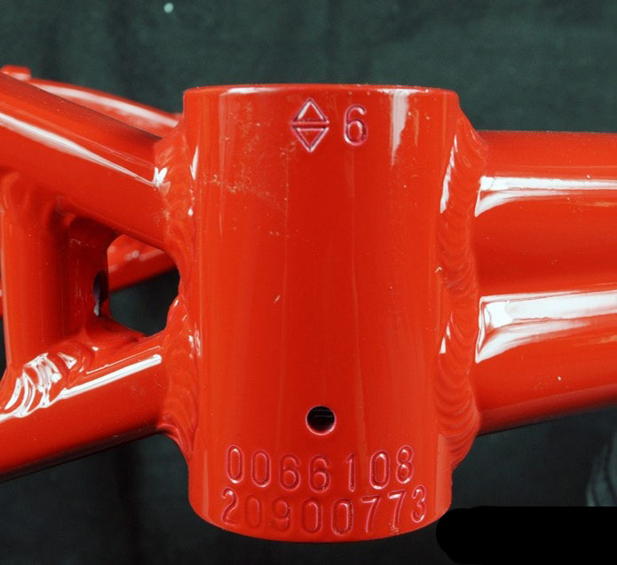

# README

开放自行车联盟。

----

> **请不要购买没有车架号的自行车，尤其是二手自行车，这种车要么是偷来的黑车，要么是假车。**

## 什么是车架号，印在什么地方？

* 车架号是自行车出厂时的唯一编号，记录了自行车的生产批次。
* 车架号一般是 15位的数字，同一个厂商的前几位，全国都一样的（每个厂商间不同）。
* 车架号一般以钢印形式印在自行车五通（脚踏中轴）下面的位置，把自行车翻过来可以看到。
* 可以通过厂商服务热线查询车架号的真伪。例如捷安特厂商的服务电话是 800-8288-868

